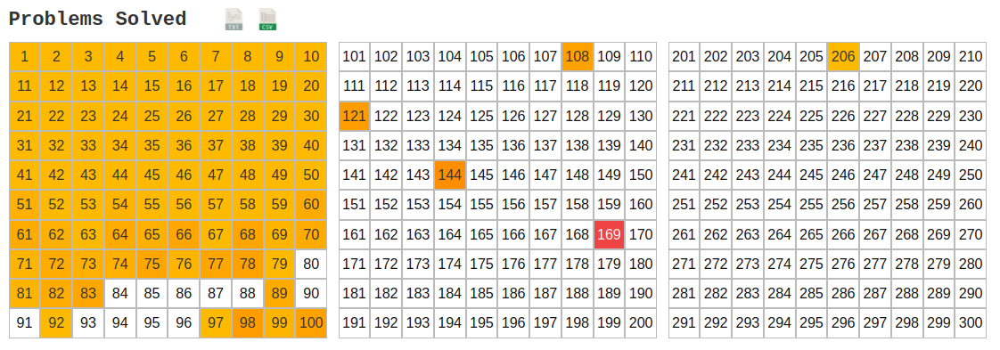

# Hi there 👋

## Who am I?

I am a student at Brighton College who is interested in learning Rust for systems programming and has quite a bit of experience of using javascript and React for full-stack development of web applications. I have also used Java and Python for various projects, such as for data processing and robotics (see below).

I am taking A-levels in mathematics, further mathematics, chemistry, physics and computer science and doing quite a bit of reading on computer science concepts in my spare time. I am planning on writing an EPQ on sharing memory safely across threads.

I enjoy exploring concepts and nuances of programming that can be used to make programs safer or more performant, such as possible compiler optimisations and what exactly goes wrong when they give us an unexpected result.

## Contact me

You can find my profile on [LinkedIn](https://www.linkedin.com/in/mikhail-nekrasov-398801237).

## My knowledge of programming languages (roughly in my order of confidence with them)

-   Javascript (with jsx)
-   Rust
-   Python
-   Typescript
-   C++
-   Java
-   C#
-   SQL

## The frameworks and libraries I have experience with

-   Node.js
-   Next.js (including React)
-   Express.js
-   Processing
-   P5.js

## The tools I know how to use

-   Vim and Emacs
-   Linux
-   Unity
-   Gimp
-   Blender
-   Git

## My Github Stats

## A guide to my projects (sorted roughly from youngest to oldest):

-   [Filephile](https://github.com/micnekr/filephile) - a customisable command-line file manager written in rust
-   [Cryptography whiteboard](https://github.com/micnekr/cryptography_whiteboard) - a work-in-progress library for prototyping of cryptographic algorithms
-   [2021-2022 astropi code](https://github.com/apollo-1845/Team-2) - the code we sent to the ISS during the 2021-2022 astropi competition
-   2021 FTC code - code for the 2021 FTC competition (the repository was left private)
-   [Unity group project](https://github.com/BC-Unity-Project-2022/Unity-Catastrophe-Island-Game-2022) - a game we completed in a group of 4 people
-   [Mass game](https://github.com/micnekr/mass_game) - a proof-of-concept unity game
-   [Social app](https://github.com/micnekr/social-app/) - another example of a next.js application I have made
-   [Minecraft-aternos-bot](https://github.com/micnekr/minecraft-aternos-bot) - a small discord bot for managing aternos servers
-   [Minecraft-server-status-improved](https://github.com/micnekr/minecraft-server-status-improved) - an improvement over a small node.js library for getting a minecraft server status
-   [Db](https://github.com/micnekr/db) - a proof-of-concept database
-   [2020 FRC code](https://github.com/brightonfrc/2020FRCCode-new) - our code for the 2020 [FRC](https://www.firstinspires.org/robotics/frc) competition
-   [Cybervolutneers v1](https://github.com/CyberVolunteers/Server-v1) - the first version of the code for the server for the [CyberVolunteers](https://cybervolunteers.org.uk/) project I wrote all of the backend and some of the front-end for. I also worked on the second version and played a similar role.
-   [Chat](https://github.com/micnekr/chat) - a basic chat app written in Node.js
-   [Processing sketches](https://github.com/micnekr/Processing-projects) - a collection of projects I was coding along [these videos](https://www.youtube.com/c/TheCodingTrain) to learn processing, a java framework
-   [p5.js sketches](https://github.com/micnekr/p5js) - a collection of projects I was coding along [these videos](https://www.youtube.com/c/TheCodingTrain) to learn javascript

### More information about my other activities and skills

1.  [British Informatics Olympiad paper](https://www.olympiad.org.uk/)

    I have scored more than 50% in the British Informatics Olympiad twice (with the maximum of 60%) and I got the best score in the school one time.

2.  Outreach

    I have been working with a team of Brighton College&rsquo;s Digital Ambassadors to teach children outside of Brighton College programming.
    I have also volunteered to help a person from a younger year of Brighton College with learning how to code in python.

3.  [FIRST Robotics](https://www.firstinspires.org/)

    1.  2020 - FRC
    
        During Brighton College&rsquo;s first ever FIRST competition, me and a team of other engineers and programmers focused on building a robot that would go onto competing in Turkey.
        I was in the programming and electronics teams and had to use online resources to learn how to use the framework, understand how the hardware works and how to set up the cable connections and software.
    
    2.  2021 - FRC
    
        Since I was one of the few people who has had experience in the competition and did not have external exams in this year, I volunteered to teach the people who wanted to join the programming and electronics teams. Unfortunately, we could not start building the robot due to the COVID-19 outbreak.
    
    3.  2022 - FTC
    
        Because of the risks and uncertainties associated with international flights during COVID, we decided to participate in FTC (a domestic competition) instead. I took part in designing and conducting the interviewing process and after that, I was working on communication between the two engineering and the programming team while helping them in solving their problems. This has taught me communication and management skills.

4.  [Project Euler](https://projecteuler.net/about)

    Since the last time this page has been updated, I have solved 88 problems. These problems have encouraged me to look more into optimising computation using dynamic programming and other techniques, requiring a combination of problem solving skills, a knowledge of mathematics and using programming as a tool of thought.
    

5.  Microsoft Imagine Cup Junior

    Me and three other Brighton College students took part in the Microsoft Imagine Cup Junior competition writing a proposal of how Artificial Intelligence can be used to detect unexpected patterns in emotions and mood swings in order to detect if a person might need to visit a mental health professional since those symptoms can be linked to a mental illness. We outlined an architecture of the neural network to process both the audio and the content of speech.

